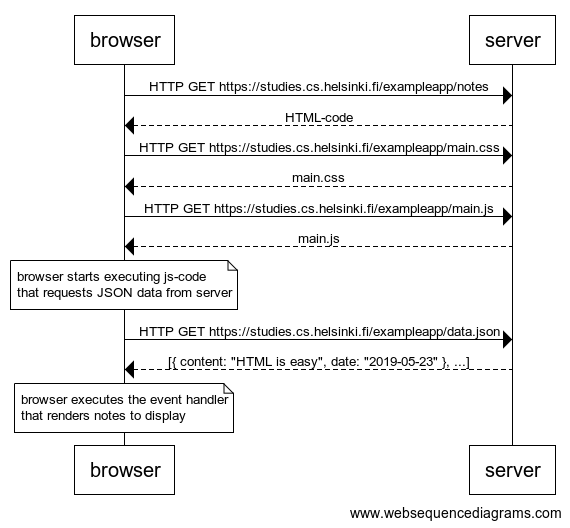

# Exercises 0.1. - 0.6
From [part 0](https://fullstackopen.com/en/part0/fundamentals_of_web_apps#exercises-0-1-0-6) of Full Stack Open 2020

### 0.1: HTML
Review the basics of HTML by reading this tutorial from Mozilla: [HTML tutorial](https://developer.mozilla.org/en-US/docs/Learn/Getting_started_with_the_web/HTML_basics).

[My response](0.1.md)

### 0.2: CSS
Review the basics of CSS by reading this tutorial from Mozilla: [CSS tutorial](https://developer.mozilla.org/en-US/docs/Learn/Getting_started_with_the_web/CSS_basics).

[My response](0.2.md)

### 0.3: HTML forms
Learn about the basics of HTML forms by reading Mozilla's tutorial [Your first form](https://developer.mozilla.org/en-US/docs/Learn/Forms/Your_first_form).

[My response](0.3.md)

## Reference for exercises 0.4 - 0.6

### 0.4: new note
Create a similar diagram depicting the situation where the user creates a new note on 
page https://studies.cs.helsinki.fi/exampleapp/notes by writing something into the text 
field and clicking the submit button.

[My response](0.4.md)

### 0.5: Single page app
Create a diagram depicting the situation where the user goes to the single page app version of the
notes app at https://studies.cs.helsinki.fi/exampleapp/spa.

### 0.6: New note
Create a diagram depicting the situation where the user creates a new note using the single page version of the app.
